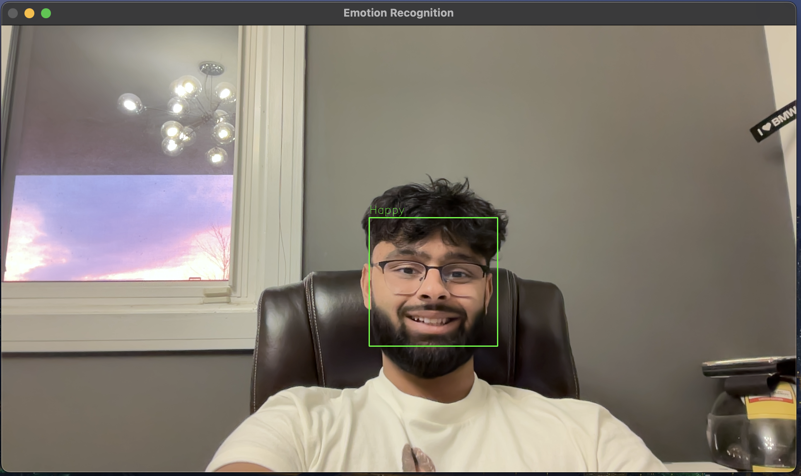

# EmotionRecognitionAI

## Project Overview

EmotionRecognitionAI is a computer vision project developed in Python for real-time recognition and classification of human emotions using facial expressions. This project utilizes a trained deep learning model to detect and classify emotions such as Anger, Disgust, Fear, Happiness, Sadness, Surprise, and Neutral.

## Features

- **Real-time Emotion Recognition:** EmotionRecognitionAI employs computer vision techniques to recognize and classify emotions in real time through a webcam feed.

- **Multi-Class Emotion Classification:** The model can detect and classify multiple emotions, providing insights into various human facial expressions.

- **Modular and Extendable:** The codebase is designed to be modular and extensible, allowing for easy integration of new models, fine-tuning, or expansion of the recognized emotions.

## Getting Started

To begin using EmotionRecognitionAI, follow these steps:

1. **Clone the Repository:** Clone this repository to your local machine using the command: `git clone https://github.com/zayedu/Emotion-Detector.git`

2. **Install Dependencies:** Ensure you have Python 3.11 installed and install the required libraries.

3. **Run the Application:** Execute the main Python script to start recognizing emotions using your webcam: `python emotion_recognition.py`

## Contributions

Contributions to EmotionRecognitionAI are welcome! Whether you want to improve the model's accuracy, add support for additional emotions, or enhance its functionalities, feel free to submit a pull request.

## License

This project is licensed under the MIT License - see the [LICENSE](Resources/License) file for details.

## Contact

- For inquiries, suggestions, or collaborations, please contact [umerz@mcmaster.ca](mailto:umerz@mcmaster.ca).
